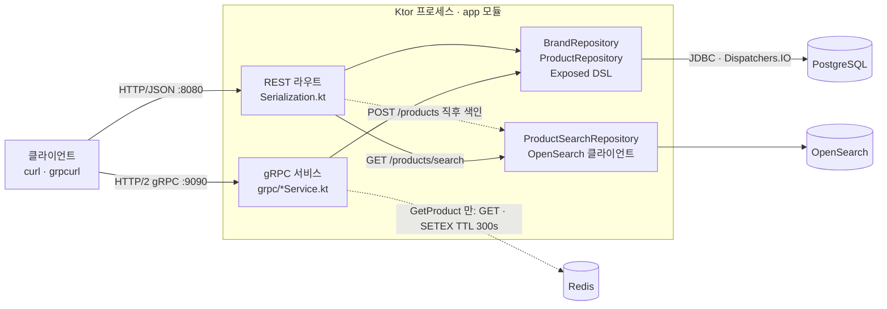

# capstone-project

Ktor 한 프로세스에 **REST와 gRPC 두 표면**을 올린 브랜드/상품 API입니다. 원본 데이터는 PostgreSQL(Exposed)에 있고, gRPC 상품 조회에는 Redis cache-aside가, 상품 검색에는 OpenSearch 색인이 붙어 있습니다.

## 아키텍처



점선이 이 프로젝트의 특징입니다. **캐시는 gRPC 조회 경로에만, 색인은 REST 생성 경로에만** 붙어 있습니다. 두 표면이 같은 리포지토리를 공유하지만 캐시·색인은 공유하지 않으며, 그 비대칭이 아래 [알려진 한계](#알려진-한계)의 원인입니다.

부팅 순서는 코드가 아니라 `application.yaml`의 `ktor.application.modules` 목록이 정합니다. `configureDependencyInjection` → `configureSerialization` → `configureGrpc` 순서로 불리고, 첫 모듈이 DB 스키마 생성·Redis 연결·OpenSearch 인덱스 생성까지 모두 처리합니다.

## 구성 요소와 포트

| 구성 요소 | 컨테이너 내부 | 호스트 | 비고 |
| --- | --- | --- | --- |
| 앱 (REST) | 8080 | 8080 | |
| 앱 (gRPC) | 9090 | — | compose에 publish돼 있지 않습니다. gRPC는 `./gradlew run`으로 띄울 때만 호스트에서 호출할 수 있습니다 |
| PostgreSQL | 5432 | 15432 | |
| Redis | 6379 | 16379 | |
| OpenSearch | 9200 | 19200 | 보안 플러그인 비활성(`plugins.security.disabled=true`) |

## 실행

### 전체를 컨테이너로

```bash
docker compose up --build
```

기동 시 `brands`·`products` 테이블과 `products` 인덱스가 없으면 생성됩니다.

```bash
curl localhost:8080/products
curl -X POST localhost:8080/brands -H 'Content-Type: application/json' \
  -d '{"name":"nike","description":"스포츠"}'
```

### 앱만 로컬에서

앱은 기동 시점에 Redis에 연결하고 OpenSearch 인덱스를 확인합니다. 따라서 **의존 컨테이너 세 개가 모두 떠 있어야** 시작됩니다.

```bash
docker compose up -d db redis opensearch
./gradlew run
```

이때는 `application.yaml`의 기본값에 따라 `localhost`의 15432·16379·19200으로 붙습니다. gRPC는 reflection이 켜져 있어 스키마 파일 없이 바로 호출됩니다.

```bash
grpcurl -plaintext localhost:9090 list
grpcurl -plaintext -d '{"id":1}' localhost:9090 io.marqvision.capstone.ProductService/GetProduct
```

## REST API

| 메서드 | 경로 | 성공 | 실패 |
| --- | --- | --- | --- |
| GET | `/brands` | 200 | |
| POST | `/brands` | 201 | |
| GET | `/brands/{id}` | 200 | 404, 400 |
| PUT | `/brands/{id}` | 200 | 404, 400 |
| DELETE | `/brands/{id}` | 204 | 404, 409, 400 |
| GET | `/products` | 200 | |
| POST | `/products` | 201 | 422 |
| GET | `/products/{id}` | 200 | 404, 400 |
| PUT | `/products/{id}` | 200 | 404, 422, 400 |
| DELETE | `/products/{id}` | 204 | 404, 400 |
| GET | `/products/search?q=&brandId=` | 200 | |

- **400** — 경로의 `{id}`가 정수가 아님
- **409** — 상품이 남아 있는 브랜드를 삭제하려 함
- **422** — 존재하지 않는 `brandId`를 참조

상품 조회 응답에는 브랜드가 중첩되어 담깁니다.

```json
[{"id":1,"name":"air-max","price":159000,
  "brand":{"id":2,"name":"nike","description":"스포츠"}}]
```

`/products/search`는 점수를 함께 돌려줍니다. 라우트 등록 순서상 `/products/{id}`가 먼저 선언돼 있지만, Ktor가 상수 세그먼트를 경로 파라미터보다 우선 채점하므로 `/products/search`로 정상 매칭됩니다.

```json
[{"product":{"id":6,"brandId":4,"name":"air-max","price":159000},"score":0.09025819}]
```

## gRPC API

proto는 `stub` 모듈에 있고, 서버와 (앞으로 만들) 클라이언트가 같은 모듈을 공유합니다. 생성된 스텁은 `stub`의 `api` 의존성으로 소비 모듈에 노출됩니다.

| 서비스 | RPC | 성공 | 실패 Status |
| --- | --- | --- | --- |
| `BrandService` | `GetBrand` | `Brand` | `NOT_FOUND` |
| `BrandService` | `CreateBrand` | `Brand` | `INVALID_ARGUMENT` |
| `ProductService` | `GetProduct` | `Product` | `NOT_FOUND` |
| `ProductService` | `CreateProduct` | `Product` | `INVALID_ARGUMENT`, `FAILED_PRECONDITION` |

- `INVALID_ARGUMENT` — 이름이 빈 문자열. proto3는 `string` 기본값이 `""`라 "미지정"과 구분되지 않으므로 직접 검증합니다.
- `FAILED_PRECONDITION` — 존재하지 않는 `brand_id` 참조 (REST의 422와 같은 상황)
- 예외를 그대로 두면 `UNKNOWN`이 나가므로 `StatusException`으로 변환해 던집니다.

## 검색 동작

`products` 인덱스를 명시적 매핑으로 만듭니다.

| 필드 | 타입 | 용도 |
| --- | --- | --- |
| `name` | `text` + `keyword` 서브필드 | `match` 질의 대상 |
| `brandId` | `integer` | `term` 필터 |
| `price` | `integer` | 향후 range 필터 대비 |

`q`는 `match`(`OR`), `brandId`는 `filter` 안의 `term`으로 들어가고 결과는 최대 50건입니다.

**부분 일치는 단어(토큰) 단위입니다.** `text` 필드는 색인할 때 standard analyzer로 이미 쪼개지므로, `air-max`는 `[air, max]`로 저장됩니다. 그래서 `q=air`·`q=max`·`q=AIR`은 맞지만 **`q=ai`는 0건**입니다. 접두/부분 문자열 검색이 필요하면 색인 시점 분석기를 바꿔야 합니다.

## 캐시 동작

gRPC `GetProduct`만 cache-aside를 씁니다.

- 키 `cache:product:{id}`, TTL 300초, 값은 `ProductWithBrand`의 JSON
- 미스일 때만 DB를 읽고 `SETEX`로 채웁니다
- **무효화가 없습니다.** REST로 상품을 바꾸거나 지워도 캐시는 TTL이 끝날 때까지 남습니다

## 설정

`app/src/main/resources/application.yaml`이 포트, 모듈 목록, 접속 정보를 담습니다. `mainClass`가 `io.ktor.server.netty.EngineMain`이라 자동으로 로드됩니다.

```yaml
storage:
  jdbcURL: "$DATABASE_JDBC_URL:jdbc:postgresql://localhost:15432/ktor_tutorial_db"
```

`"$VAR:기본값"` 문법이라, 컨테이너 안에서는 compose가 넘기는 환경 변수를, 로컬에서는 뒤의 기본값을 씁니다.

| 환경 변수 | 기본값 |
| --- | --- |
| `DATABASE_JDBC_URL` | `jdbc:postgresql://localhost:15432/ktor_tutorial_db` |
| `REDIS_HOST` / `REDIS_PORT` | `localhost` / `16379` |
| `OPENSEARCH_HOST` / `OPENSEARCH_PORT` | `localhost` / `19200` |

## 설계 메모

**트랜잭션 경계는 리포지토리에 둡니다.** 라우트에서 브랜드 존재를 확인한 뒤 상품 생성을 호출하면 두 작업이 서로 다른 트랜잭션이 되어, 그 사이에 브랜드가 삭제될 수 있습니다. 확인과 INSERT/UPDATE는 리포지토리의 한 `withTransaction` 안에서 처리합니다. 트랜잭션 하나가 락은 아니므로, 남는 경쟁 구간은 FK 제약이 막습니다.

**참조 무결성 위반은 4xx로 내려갑니다.** DB 예외를 그대로 흘리면 500이 나가므로, 리포지토리가 sealed 타입으로 결과를 돌려주고 라우트가 상태 코드를 정합니다. 이때 SQLSTATE가 둘로 갈립니다 — 없는 부모를 참조하는 INSERT/UPDATE는 `23503`, RESTRICT가 막은 부모 DELETE는 `23001`입니다.

**목록 조회는 JOIN 한 번입니다.** 상품마다 브랜드를 따로 읽으면 N+1이므로 `ProductTable.innerJoin(BrandTable)`로 한 번에 읽습니다.

**JDBC는 블로킹입니다.** `suspend` 함수라고 스레드를 옮겨주지는 않으므로, `withTransaction`이 `Dispatchers.IO`로 전환해 요청 처리 스레드를 막지 않습니다. 같은 헬퍼가 `StdOutSqlLogger`를 붙여 실행된 SQL을 콘솔에 남깁니다. 참고로 `withTransaction` 블록은 `SQLException`이 나면 Exposed가 최대 3번까지 **다시 실행**합니다.

## 알려진 한계

마일스톤 범위를 넘어 아직 정리하지 못한 지점입니다. 읽는 분이 "버그인가?" 하고 멈추지 않도록 적어둡니다.

- **색인 정합성** — 색인은 `POST /products`에서만 일어납니다. `PUT`/`DELETE`는 재색인하지 않고, 검색 기능 이전에 만든 상품을 밀어넣는 백필 경로도 없습니다. 그래서 DB와 색인 건수가 이미 다릅니다.
- **색인 실패가 생성 실패로 보고됩니다** — Postgres 커밋 뒤에 색인이 실패하면 500이 나가므로, 클라이언트가 재시도하면 상품이 중복 생성될 수 있습니다.
- **캐시 무효화가 없습니다** — 위 [캐시 동작](#캐시-동작) 참고.
- **의존 서비스 장애가 전파됩니다** — Redis·OpenSearch에 기동 시점부터 연결하므로 둘 중 하나가 없으면 서버 전체가 뜨지 않습니다. 조회 경로에도 fail-open 처리가 없습니다.
- **`ProductSearchRepository.search()`는 IO 디스패처로 전환하지 않습니다** — 같은 클래스의 `index()`와 달리 동기 OpenSearch 클라이언트를 요청 스레드에서 그대로 호출합니다.
- **gRPC 클라이언트 모듈이 없습니다** — `stub`은 공유 준비가 돼 있지만 소비자는 아직 서버뿐이고, compose에도 9090이 열려 있지 않습니다.
- **테스트가 없습니다** — JUnit 5/`kotlin-test` 설정만 되어 있습니다.

## 프로젝트 구조

| 경로 | 설명 |
| --- | --- |
| `app/src/main/resources/application.yaml` | 포트, **모듈 목록(= 부팅 순서)**, 접속 정보 |
| `app/src/main/kotlin/org/example/DI.kt` | DB·Redis·OpenSearch 클라이언트 생성과 리포지토리 등록 |
| `app/src/main/kotlin/org/example/Serialization.kt` | ContentNegotiation 설치 + **REST 라우트 전체**와 요청 DTO |
| `app/src/main/kotlin/org/example/Exposed.kt` | DB 연결, 스키마 생성, `withTransaction` |
| `app/src/main/kotlin/org/example/BrandRepository.kt` | 브랜드 저장소 인터페이스/구현 |
| `app/src/main/kotlin/org/example/ProductRepository.kt` | 상품 저장소 인터페이스/구현 |
| `app/src/main/kotlin/org/example/ProductSearchRepository.kt` | OpenSearch 클라이언트, 인덱스 매핑, 색인/검색 |
| `app/src/main/kotlin/org/example/grpc/` | gRPC 서버 기동과 두 서비스 구현 (상품 조회 캐시 포함) |
| `app/src/main/kotlin/org/example/db/` | Exposed 테이블 정의 |
| `app/src/main/kotlin/org/example/model/` | 직렬화되는 도메인 모델 |
| `app/src/main/kotlin/org/example/App.kt` | 1주차 코루틴 예제. **진입점이 아닙니다** |
| `stub/src/main/proto/` | proto 정의. 빌드 시 Java/Kotlin 스텁을 생성합니다 |
| `Dockerfile`, `compose.yml` | 컨테이너 실행 |

## 빌드

```bash
./gradlew build          # 컴파일 + 검증 (stub의 protoc 생성 포함)
./gradlew buildFatJar    # app/build/libs/app-all.jar 생성
```

## 주요 의존성

- Kotlin JVM 2.4.0, Gradle 9.7.1, JDK 21 툴체인
- Ktor 3.5.2 — server-core, netty, content-negotiation, DI, config-yaml
- Exposed 1.5.0 + PostgreSQL JDBC 42.7.13
- gRPC 1.75.0 / grpc-kotlin 1.5.0 / protobuf 4.33.0 (protobuf Gradle 플러그인 0.9.5)
- Lettuce 7.6.0 — Redis 클라이언트
- opensearch-java 2.14.0 + jackson-module-kotlin 2.17.2
- kotlinx-serialization 1.11.0, Logback 1.6.3
